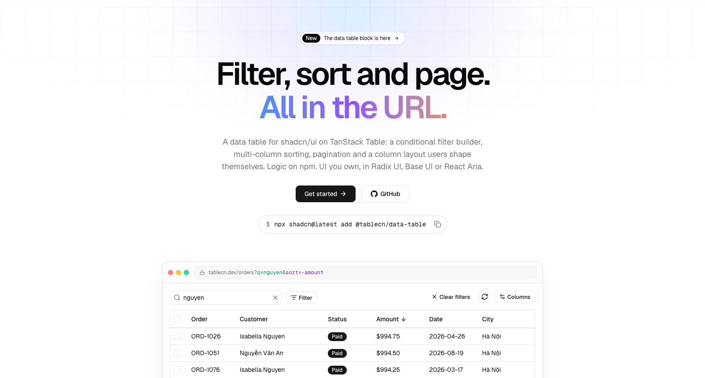

<p align="center">
  <picture>
    <source media="(prefers-color-scheme: dark)" srcset="./.github/assets/banner-dark.png" />
    
  </picture>
</p>

<h1 align="center">tablecn</h1>

<p align="center">
  Free & open-source data table building blocks for shadcn/ui.<br/>
  Filter, search, sort and page, all in the URL. Built on <a href="https://tanstack.com/table">TanStack Table</a>. Install via <a href="https://ui.shadcn.com/">shadcn CLI</a>.
</p>

<p align="center">
  <a href="https://github.com/minhduoc-tran/tablecn"></a>
  <a href="https://github.com/minhduoc-tran/tablecn/actions"></a>
  <a href="LICENSE"></a>
</p>

<p align="center">
  <a href="apps/web/content/docs/index.mdx">Get Started</a> ·
  <a href="apps/web/content/docs/table/installation.mdx">Installation</a> ·
  <a href="apps/web/content/docs/table/index.mdx">Table</a> ·
  <a href="apps/web/content/docs/filter/index.mdx">Filter</a>
</p>

## Features

- **Filter builder** — "Where *Status* is *Paid* and *Amount* is between *10* and *50*", with seven field types, fifteen operators and AND / OR
- **Search** — Across columns, ignoring case and accents: `nguyen ha noi` finds "Nguyễn Văn An" in "Hà Nội"
- **Everything in the URL** — `?q=nguyen&status__eq=paid&sort=-amount&page=2`: shareable links, back/forward, a new filter goes back to page 1
- **Client or server data** — Filter, sort and page in the browser, or send the URL to JSON:API, Django REST framework, PostgREST or your own backend
- **A layout users keep** — Drag, pin, resize, hide and color columns, saved in the browser and merged with the columns you ship later
- **Thousands of rows** — Virtualization with the sticky header and pinned columns intact
- **Three primitive libraries** — Every block in Radix UI, Base UI and React Aria, with the same props
- **Accessible and localized** — Keyboard sorting and column moves with announcements; English and Vietnamese included

## Quick start

Add the registry to your `components.json`, with the folder for your primitive library (`radix`, `base` or `aria`):

```json
{
  "registries": {
    "@tablecn": "https://raw.githubusercontent.com/minhduoc-tran/tablecn/main/apps/web/public/r/radix/{name}.json"
  }
}
```

Then add the blocks:

```bash
npx shadcn@latest add @tablecn/data-table
npx shadcn@latest add @tablecn/filter-builder
```

The logic comes along as npm packages:

| Package | What it is |
| --- | --- |
| [`@querycn/filter-core`](packages/filter-core) | Rules, URL codec, backend serializers, client-side filtering. No dependencies |
| [`@querycn/filter-react`](packages/filter-react) | Filter provider, hooks and URL adapters |
| [`@querycn/filter-next`](packages/filter-next) | Next.js App Router adapter and a server parser |
| [`@querycn/table-react`](packages/table-react) | `useDataTable` on TanStack Table v9: URL state, saved layout, search, server params |

## Community

The tablecn community lives on [GitHub](https://github.com/minhduoc-tran/tablecn), where you can ask questions, share ideas, and show what you've built.

## Contributing

Contributions are welcome. See [Development](apps/web/content/docs/development.mdx) to get the repo running locally, and use [issues](https://github.com/minhduoc-tran/tablecn/issues) to report bugs or suggest features. After changing a registry component, run `pnpm registry:build` and commit `apps/web/public/r` with it.

## Security

Please do not open public issues for security vulnerabilities. Report them privately through [GitHub Security Advisories](https://github.com/minhduoc-tran/tablecn/security/advisories/new).

## License

[MIT](LICENSE)

## Contributors

[](https://github.com/minhduoc-tran/tablecn/graphs/contributors)

> Made with [contrib.rocks](https://contrib.rocks)

## Star History

<a href="https://www.star-history.com/#minhduoc-tran/tablecn&Date">
  <picture>
    <source media="(prefers-color-scheme: dark)" srcset="https://api.star-history.com/svg?repos=minhduoc-tran/tablecn&type=Date&theme=dark" />
    
  </picture>
</a>
