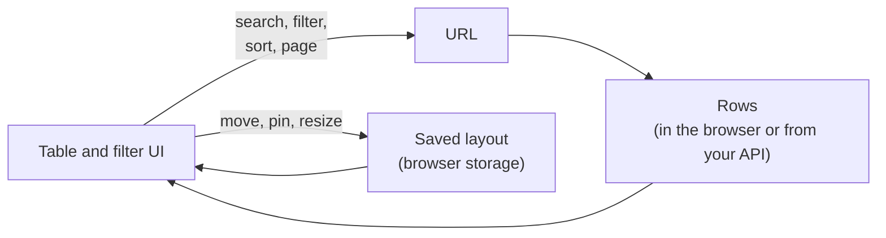

This page follows one view of an orders table: **search for "nguyen", only paid orders, the biggest amounts first, page 2**. Each section introduces one idea you'll see in the rest of the docs.



## The URL holds the view

Everything that decides *which rows* you see is written to the URL:

```txt title="URL"
/orders?q=nguyen&status__eq=paid&sort=-amount&page=2
```

| Param | Written by | Meaning |
| --- | --- | --- |
| `q=nguyen` | the search box | rows containing "nguyen" |
| `status__eq=paid` | the filter | Status is Paid |
| `sort=-amount` | a header click | biggest amount first (`-` means descending) |
| `page=2` | the pagination | the second page |

So users can reload, share a link, or press Back, and get the same view. An **adapter** connects this to your router: Next.js, react-router or the plain browser history. When a URL is read, everything in it is checked: a broken or outdated link gives a smaller view, never an error.

Learn more in [URL state](/docs/table/url-state).

## Columns: what the table shows

Columns are [TanStack Table](https://tanstack.com/table) column definitions. Each one has an id, which is also the name used in `sort=`:

```tsx title="Columns"
const column = createDataTableColumnHelper<Order>()

export const orderColumns = [
  column.accessor("customer", { header: "Customer" }),
  column.accessor("amount", { header: "Amount" }),
]
```

`useDataTable` turns your columns and rows into a table, with the search, sort and page read from the URL. Learn more in [Columns](/docs/table/columns).

## Fields: what users can filter by

Fields are the filter's side. Each has a name, a label and a type:

```ts title="Fields"
export const orderFields: FieldDefinition[] = [
  { name: "status", label: "Status", type: "select", options: [/* … */] },
  { name: "amount", label: "Amount", type: "number" },
]
```

The type decides which operators users get: a number field offers "is greater than", a text field "contains". Learn more in [Fields](/docs/filter/fields).

## Rules: one condition each

Each condition in the filter is a **rule**: a field, an operator and a value.

| What the user sees | `field` | `operator` | `value` |
| --- | --- | --- | --- |
| Status **is** Paid | `status` | `eq` | `"paid"` |
| Amount **is between** 10 and 50 | `amount` | `between` | `[10, 50]` |

Rules are combined with **AND** (every rule must match) or **OR** (any rule may match). The operator decides the value's shape (called its *arity*): nothing for *is empty*, one value for *is*, a pair for *is between*, a list for *is any of*. See every operator in [Operators](/docs/filter/operators).

While users edit rules, nothing changes. Only **Apply** writes the complete rules to the URL, so your data doesn't reload on every keystroke.

## Client or server data

Someone has to do the searching, filtering, sorting and paging:

| | Client mode (default) | Server mode |
| --- | --- | --- |
| You pass | every row | one page of rows, and the total |
| The work is done by | the browser | your backend |
| Good for | up to a few thousand rows | anything bigger |

In server mode, tablecn reads the URL and builds the request for you. The same view becomes:

| Backend | Request |
| --- | --- |
| JSON:API style | `filter[status][eq]=paid&sort=-amount&page[number]=2&page[size]=20&filter[search]=nguyen` |
| django-filter / DRF | `status=paid&ordering=-amount&page=2&page_size=20&search=nguyen` |
| your own | whatever your API expects |

Learn more in [Server data](/docs/table/server-data).

## The layout is personal

Hidden columns, their order, pins, widths and colors are the **layout**. It isn't in the URL: a shared link shows the same rows, but each user keeps their own columns. The layout is saved in the browser under a `storageKey` you choose. Learn more in [Layout](/docs/table/layout).

## Where each piece lives

| Piece | What it does |
| --- | --- |
| `data-table` (registry) | The table UI, copied into your project. |
| `filter-builder` (registry) | The filter UI, copied into your project. |
| `@querycn/table-react` | `useDataTable`, the table's URL state, the layout, request builders for sort and page. |
| `@querycn/filter-react` | `FilterProvider`, the filter hooks, the URL adapters. |
| `@querycn/filter-next` | The Next.js adapter, and `parseFilters` for server components. |
| `@querycn/filter-core` | Fields, rules, the filter's URL format and request builders. No dependencies. |
