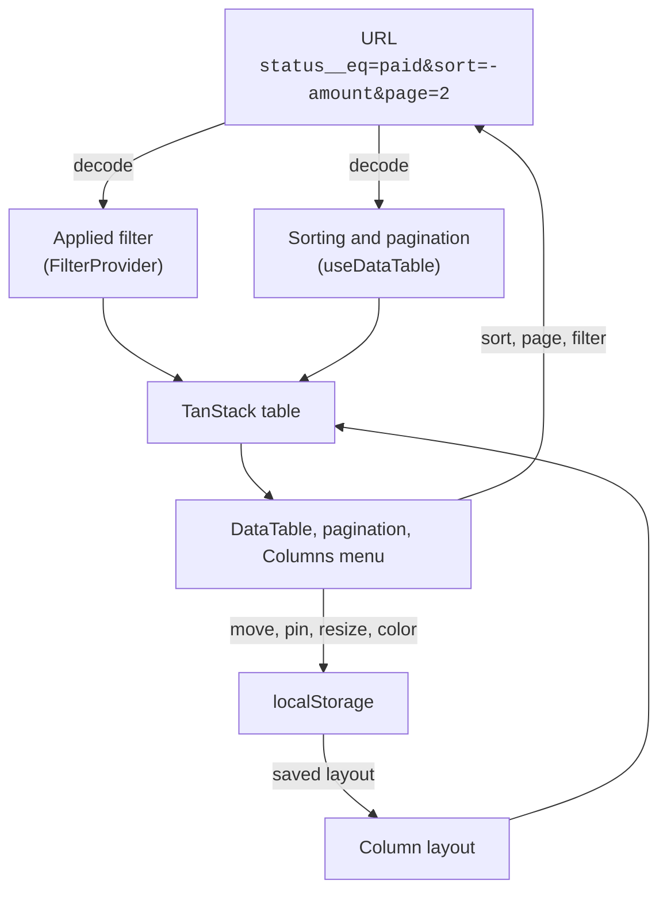

import { TablePreview } from "@/components/docs/table-preview"

<TablePreview />

Try it: click a header to sort (<kbd>Shift</kbd>+click adds a second column), go to another page, add a filter. Everything that decides *which rows* you see is written to this page's URL, so reload or share the link and you get the same view. Then drag a header to move it, resize a column, or open **Columns** to pin, hide or color one. That's the *layout*, and it's saved in this browser.

## What you get

The table comes in two parts, like the filter:

- **`@querycn/table-react`** is headless. `useDataTable` returns a [TanStack Table](https://tanstack.com/table) v9 instance with sorting and pages synced to the URL, the applied filter wired in, row selection, and the column layout saved to `localStorage`.
- **The `data-table` registry block** renders it with shadcn/ui: the table with a sticky header and pinned columns, column headers, pagination, the **Columns** menu, a toolbar and a selection bar. It's copied into your project, in a Radix UI, Base UI or React Aria version.

## Features

- **Sorting** by one or several columns, in the URL as `sort=-amount,name`.
- **Pages** in the URL as `page=2&per_page=50`, with a rows-per-page picker and page buttons. A page past the last one shows the last one.
- **The filter plugs in.** Put a `FilterProvider` around the table: in client mode the applied filter narrows the rows, in server mode it goes into the request. Filter, sort and page share one URL, and a new filter goes back to page 1 in the same navigation.
- **Client or server data.** Give it every row and it filters, sorts and pages in the browser. Or give it one page and a total, and let [`useTableQuery`](/docs/table/server-data) turn the URL into a request for JSON:API, django-filter or PostgREST.
- **A layout users own**: show and hide, reorder by dragging, pin to either side, resize (double-click to fit the content), color columns. Saved per table and merged with your column changes. See [Layout & persistence](/docs/table/layout).
- **Row selection**, with a bar for bulk actions.
- **Loading, empty and error states**, with a retry button.
- **Virtualization** for pages of thousands of rows. See [Virtualization](/docs/table/virtualization).
- **Accessible**: sort menus and column moves work from the keyboard, and screen readers hear what happens.
- **Localized**: English and Vietnamese messages, and every label can be overridden.

## How it works



1. **One URL holds what the user is looking at.** The filter writes `status__eq=paid`, the table writes `sort`, `page` and `per_page`. Both go through the same [adapter](/docs/filter/url-state), so back/forward and shared links restore the whole view. See [URL state](/docs/table/url-state).
2. **The layout is personal**, so it isn't in the URL. It's saved in `localStorage` under a key you choose.
3. **`useDataTable` puts it together** into a TanStack Table instance. You still write TanStack [column definitions](/docs/table/columns), and every TanStack API is there when you need it.
4. **The registry components render that instance.** They only need `table`, so you can replace any of them with your own.

## A minimal table

```tsx title="components/orders-table.tsx"
"use client"

import { createDataTableColumnHelper, useDataTable } from "@querycn/table-react"

import { DataTable } from "@/components/data-table/data-table"
import { DataTablePagination } from "@/components/data-table/data-table-pagination"

const helper = createDataTableColumnHelper<Order>()

const columns = [
  helper.accessor("customer", { header: "Customer" }),
  helper.accessor("amount", { header: "Amount" }),
]

export function OrdersTable({ orders }: { orders: Order[] }) {
  const table = useDataTable({
    data: orders,
    columns,
    getRowId: (order) => order.id,
  })

  return (
    <div className="flex flex-col gap-3">
      <DataTable table={table} className="max-h-[600px]" />
      <DataTablePagination table={table} />
    </div>
  )
}
```

Without an adapter or a `FilterProvider`, sorting and pages live in memory. [Installation](/docs/table/installation) shows how to put them in the URL and add the filter.

<Cards>
  <Card title="Installation" href="/docs/table/installation" description="The registry block, the packages, and wiring for Next.js, Vite and react-router." />
  <Card title="Columns" href="/docs/table/columns" description="Column definitions and the meta keys the table reads." />
</Cards>
