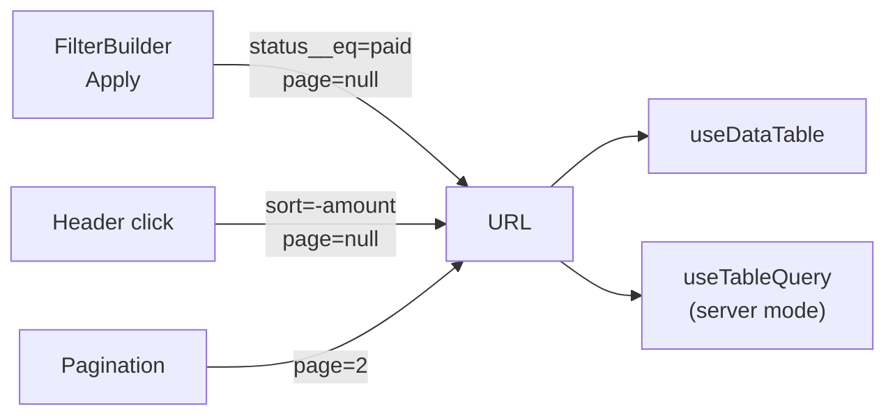

## Format

Sort and page live in the query string, next to the [filter's params](/docs/filter/url-state):

```txt title="URL"
/orders?status__eq=paid&sort=-amount,customer_name&page=2&per_page=50
```

- `sort` lists column ids, most important first. A leading `-` means descending. Up to three columns by default.
- `page` is 1-based, as people count. The table's `pageIndex` is 0-based, as TanStack Table counts.
- `per_page` is the page size. It must be one of the offered page sizes (`[10, 20, 50, 100]` by default).
- Defaults aren't written: page 1, the default page size and the default sort leave no param, so a fresh table has a clean URL.

Links are shareable, reloads keep the view, and back/forward work, because the URL is the only place this state lives.

## One URL, one navigation

The filter and the table read and write the same query string. `useDataTable` uses the nearest `FilterProvider`'s adapter by default, so there's nothing to wire:

```tsx title="Shared adapter"
<NextFilterProvider fields={orderFields} onApply={() => resetPagePatch()}>
  <OrdersTable /> {/* useDataTable here finds the provider's adapter */}
</NextFilterProvider>
```

Without a provider, pass an `adapter` to `useDataTable` (see [Installation](/docs/table/installation)). Without either, the state lives in memory and nothing touches the URL.



### Back to page 1

Page 4 of the old results means nothing for new ones, so every change that reshapes the results starts again at page 1:

- **Sort or page size.** The table does it itself, in the same write.
- **Filter.** The filter doesn't know about pages, so tell it: `onApply={() => resetPagePatch()}` on the provider. `onApply` returns params to write *along with* the filter, so the filter and `page` change in one navigation. Two separate writes would make two history entries, and with a router that rerenders on each, a render with the new filter on the old page.

`resetPagePatch(url)` returns `{ page: null }`, using your page param name if you renamed it. It also covers **Clear filters** in the toolbar and the chips' ×, since both apply through the provider.

### Pages that don't exist

`?page=40` with 3 pages of results shows page 3. In client mode the URL is left as it is. In server mode the table rewrites the URL to the last page once the backend's total is known, so the next fetch asks for a page that exists.

## Options

Pass them as `url` to `useDataTable`, the same object to `useTableQuery`, and to `parseTableParams` on the server (with `sortableColumns`, see [Rendering on the server](/docs/table/server-data#rendering-on-the-server)), so all three read the URL alike:

```ts title="URL options"
import type { TableUrlOptions } from "@querycn/table-react"

const url = {
  params: { sort: "order", page: "p", perPage: "size" },
  pageSizes: [25, 50, 100],
  defaultPageSize: 25,
  defaultSorting: [{ id: "createdAt", desc: true }],
} satisfies TableUrlOptions

useDataTable({ data, columns, getRowId, url })
```

Keep it stable (module constant or `useMemo`), like `columns`.

<TypeTable
  type={{
    params: {
      description: "Param names, to fit a URL scheme you already have or to avoid a clash.",
      type: "{ sort?: string; page?: string; perPage?: string }",
      default: '{ sort: "sort", page: "page", perPage: "per_page" }',
    },
    pageSizes: {
      description: "The sizes users can pick. A `per_page` outside them reads as the default.",
      type: "readonly number[]",
      default: "[10, 20, 50, 100]",
    },
    defaultPageSize: {
      description: "The size without a `per_page` param. Accepted even when it isn't in `pageSizes`.",
      type: "number",
      default: "20",
    },
    defaultSorting: {
      description: "The sort without a `sort` param. Clearing it writes an empty `sort=`, so it isn't read back as the default.",
      type: "SortingState",
      default: "[]",
    },
    sortableColumns: {
      description: "Column ids `sort` may name. Defaults to the columns that can sort; see Columns.",
      type: "readonly string[]",
      default: "sortable columns",
    },
    maxSortColumns: {
      description: "How many columns sort at once. Extra ones in the URL are dropped.",
      type: "number",
      default: "3",
    },
  }}
/>

## Bad URLs

A URL is user input, so reading it never throws:

- unknown, unsortable or repeated `sort` columns are dropped;
- `page` that isn't a positive whole number reads as page 1;
- `per_page` outside `pageSizes` reads as the default size.

```ts title="Decoding"
import { decodeTableParams } from "@querycn/table-react"

decodeTableParams("sort=-amount,amount,nope&page=0&per_page=7", {
  sortableColumns: ["amount", "customer_name"],
})
// → { sorting: [{ id: "amount", desc: true }], pagination: { pageIndex: 0, pageSize: 20 } }
```

## Outside useDataTable

The codec functions work anywhere, including on the server (from `@querycn/table-react/server` too):

```ts title="Codec"
import { decodeTableParams, encodeTableParams } from "@querycn/table-react"

encodeTableParams({
  sorting: [{ id: "amount", desc: true }],
  pagination: { pageIndex: 1, pageSize: 20 },
})
// → { sort: "-amount", page: "2", per_page: null }  (a ParamPatch: null removes the param)
```

With your own table setup, `useTableUrlState` gives the same state as controlled TanStack Table props:

```tsx title="useTableUrlState"
import { useTableUrlState } from "@querycn/table-react"

const url = useTableUrlState({ adapter, pageSizes: [10, 20, 50] })

const table = useTable({
  // …
  state: { sorting: url.sorting, pagination: url.pagination },
  onSortingChange: url.onSortingChange,
  onPaginationChange: url.onPaginationChange,
})
```

It takes the `TableUrlOptions` above plus `adapter`, and `pageCount` or `rowCount` to clamp pages past the last one; `isPageClamped` tells you when that happened.

<Cards>
  <Card title="Server data" href="/docs/table/server-data" description="Send the filter, sort and page to your backend." />
  <Card title="Filter URL state" href="/docs/filter/url-state" description="The filter's side of the same URL." />
</Cards>
